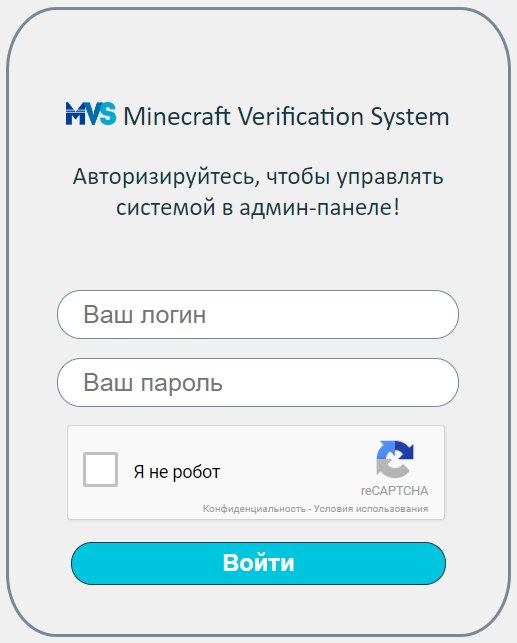
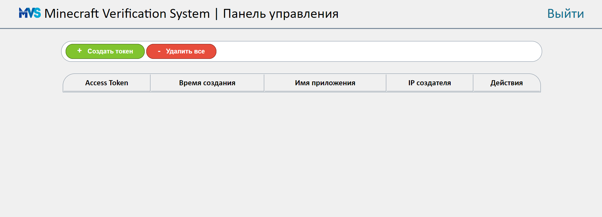
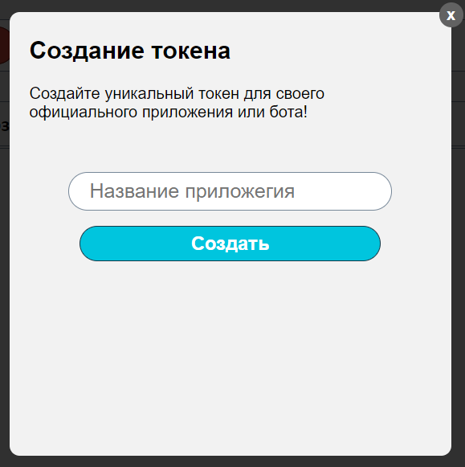
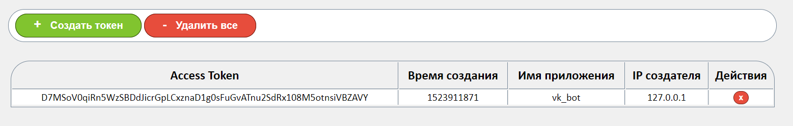

# Minecraft Verification System

**Minecraft Verification System** - достаточно массивная и обширная для дальшейшего
создания система "привязки" аккаунта Minecraft к социальной сети Вконтакт.

Принцип работы:
1. Вы должны иметь лицензионный аккаунт игры Minecraft
2. Зайдите на сервер `mc.hypixel.net` и введите команду `/api new`
3. Введите в методе `createUser` ваш Id VK и Hypixel API Key, который вы получили в предыдущем шаге.

По желанию (если иметь прямые руки или хотя бы небольшое понимания `Python Flask` и `Java`) можно изменить сервер подтверждения
на свой. Тогда авторизация будет происходить через него.

Весь принцип работы основывается на "доверенных приложениях", как в случае с Hypixel API, где вы получаете
свой уникальный ключ для работы, по которому можно подтвердить аккаунт Minecraft, так и в случае с подтверждением
странички ВК, поскольку система расчитана не на прямые запросы, а запросы через чат-бота в сообществе или на странице.

Дополнительную степень защиты оказывает кабинет администратора, в котором вы можете сами создавать и контролировать некие
`Access Token'ы`, которые являются локально серверными, дающими доступ к приватным методам. Именно эти токены должны быть
у ваших скриптов и ботов, которые будут подавать запросы, выступая в виде `доверенных приложений и/или доверенных лиц`.

Начало работы
---
Итак, сперва мы должны понять, как запустить сервер.
Но и также посмотреть, какие потребуются элементы для его запуска, а именно
зависимые модули и библиотеки
- flask (Ядро сервера)
- requests (элемент запросов на другие сервера)
- vk_advanced_api (для чат-бота ВК). [Посмотреть его можно тут.](https://github.com/Ar4ikov/vk_avdanced_api)

Следующий этап - конфигурация.
Конфигурационный файл лежит в `/server/` и именуется как `config.ini`.
Там полностью описана структура, а также каждый параметр, который необходимо указать.

И наконец - запуск. запускать нужно обязательно в директории `/server/`. Но если вы не хотите так делать, 
установите в файле `/server/api/config.py` свой путь до конфига (по дефолту стоит локальный из папки `/server/`)

Первый запуск
---

При первом запуске система потребует создать нового пользователя-администратора для входа в админ-панель и дальнейшим управлением `Access Token'ами`.


После необходимо будет войти в админ панель:
`https://<server>/admin`

Система потребует нас туда войти



Система защищена дополнительно `reCaptcha v2` от Google. Вы можете настроить свою `reCaptcha`, 
настроив заранее в конфиге ключ для нее. 

> [Подробнее о рекапче прочтите тут.](https://www.google.com/recaptcha/)
   
Далее мы попадаем на страницу с админ-панелью



Нажимаем на `Создать токен`, указываем имя приложения, которому хотим сделать новый токен (на ваше усмотрение, не хочу углубляться в такие подробности с созданием 
своих приложений и так далее). Создаем! Приложений может быть неограниченное количество.



Новый токен появился в базе данных!



Для чего нужен этот токен? Для доступа к приватным методам API, таким, как `createUser`, ведь это - служебный метод, который создает юзера на основе доверия и
подтверждения всех принимаемых им данных, таких как Id юзера ВК и Hypixel API Key от вашего Minecraft аккаунта.

Основные методы системы

Метод   | Зачем и как работает
---------|-----------
getUser | Получение юзера из MVS БД. Необходимо указать или `mvs id (id)`, или `vk`, или `mc`
getUsers | Получение всех юзеров их MVS
createUser | Создание нового пользователя. Принимает `vk`, `hypixel_key` и `access_token`
confirmUser | Принимает `hypixel_key`, нужен для проверки подлинности `hypixel_key`
На этом, пожалуй, с серверной частью и её настройкой мы закончили.

Поля, которые возможно передать

Поле | Значение поля
---------|-------------
id | Id юзера в системе MVS
vk | Id юзера ВК
mc | UUID пользователя Minecraft
hypixel_key | Hypixel API Key
access_token | Access Token приложения

Теперь разберём ответы сервера

`getUser` при удачном запросе
```json
{
  "response": {
    "user": {'id': "mvs_id", 'vk': "vk_id", 'is_banned': False, 'mc': "mc_uuid"}
  }, 
  "status": "success"
}
```

`getUsers`
```json
{
  "response": {
    "users": [
      {
        "id": 1, 
        "is_banned": "False", 
        "mc": "aa0f6b98a6b4438d96a0388d22d8e326", 
        "vk": 160213445
      }
    ]
  }, 
  "status": "success"
}

```

`createUser` при удачном запросе
```json
{
  "response": {
    "user": {'id': "mvs_id", 'vk': "vk_id", 'is_banned': False, 'mc': "mc_uuid"}
  }, 
  "status": "success"
}

```


`confirmUser`
```json
{
  "response": {
    "hypixel_key": {
      "hypixel_key": "hypixel_key", 
      "ownerUuid": "mc_uuid"
    }
  }, 
  "status": "success"
}
```

Список возвращаемых ошибок вы можете узреть в `/server/errors.txt`


Клиентская часть
---

> Клиент всегда прав, если имеет на это основания

Клиентская часть обусловлена небольшим модулем, который лишь отправляет запросы и дает ответ в виде
своего класса `MVS_Response`

Простой пример инициализации:
```python

# Импорт модуля
import mvs_client as MVS

# Объявление экземпляра класса MVS_Client
mvs = MVS.MVS_Client(
      server="http://127.0.0.1",
      access_token="D7MSoV0qiRn5WzSBDdJicrGpLCxznaD1g0sFuGvATnu2SdRx108M5otnsiVBZAVY"
)

```
где
- server - сервер MVS API
- access_token - Access Token приложения

Взаимодействие:
```python

# Получаем пользователя с MVS Id 1
response = mvs.getUser(id=1).getResponse()
print(response)

# Получаем ошибку (1. Unknown Method)
response = mvs.getUUseeeer().getErrorCode()
print(response)

```

Перейдем к классу `MVS_Response`

Метод | Его функционал
---|---
`getStatus` | Получение статуса ответа от сервера. Бывает либо `success`, либо `failed`
`getResponse` | Получение ключа `response` в ответе. Содержит основную информацию. Если была допущена ошибка, вернет None
`getErrorCode` | Получение кода ошибки о ответе. Если ошибки нет, вернет None
`getCause` | Получение причины ошибки в ответе. Если ошибки нет, вернет None
`getResponseBody` | Вернет полный ответ сервера в формате JSON

 
На этом закончим с клиентской частью

ВК Бот
---
...
...
...
...

Информация появится позже с появлением этого самого бота.

Заключение
---

Хотелось бы добавить в окончание данной документации, что система была сделана лишь в помощь тем,
кто в ней нуждается, а именно в автоматическом приеме игроков в Hypixel Guild, без какой-либо нужны проверки
уровня и статистики игрока, а уж тем более без проверки подлинности аккаунта, ведь теперь абсолютно каждый
сможет сделать это.

Спасибо за понимание и за прочтение.

Спасибо [@Trippsol](https://vk.con/trippsol) за идею, а также его проекту `MAV`, клиент для которого
от меня вы можете встретить [тут](https://github.com/Ar4ikov/MAVAPI)