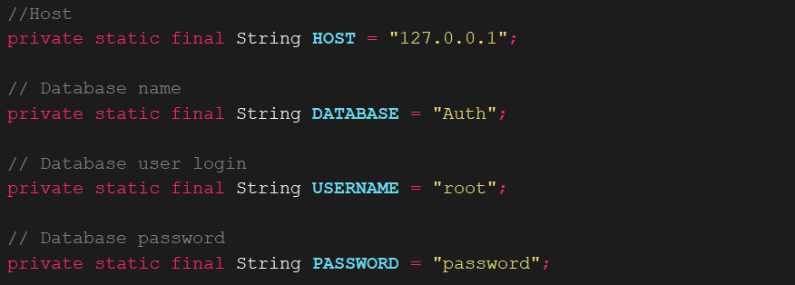

#  Minecraft Verification System Authenticator 1.12

Если вы "отличаетесь" умом или сообразительностью, то вы пожете подключить дополнительный метод подтверждения аккаунта в MVS.

Для этого я тут плагин создал такой небольшой, который работает с MySQL (Далее - миской).

- Ядро версии `1.12` 
- Поддержка миски (Вы не можете никак это сделать без миски, сорян)
- Поддержка цветной консоли (для "умных")

###  Настройка конфигурации MVS 

Ниже вы можете наблюдать конфигурацию уже в самом сервере (`/server/config.ini`). Читайте только внимательно

Далее - конфигурация в сорцах

 Я оставил вам сорцы, компилируйте сами под ядро `1.12`. Уж извините, это уже ваши заботы 	`¯\_(ツ)_/¯`

Теперь в `confirmation_type` вы сможете получать два типа подтверждения:

| Тип           | Зачем он нужен                                          |
| ------------- | ------------------------------------------------------- |
| `hypixel_key` | Подтверждение через Hypixel API Key                     |
| `mvs_auth`    | Подтверждение через кастомный сервер аутентификации MVS |

Таблица токенов кастомного сервера аутентификации MVS

На этом все :smirk:

